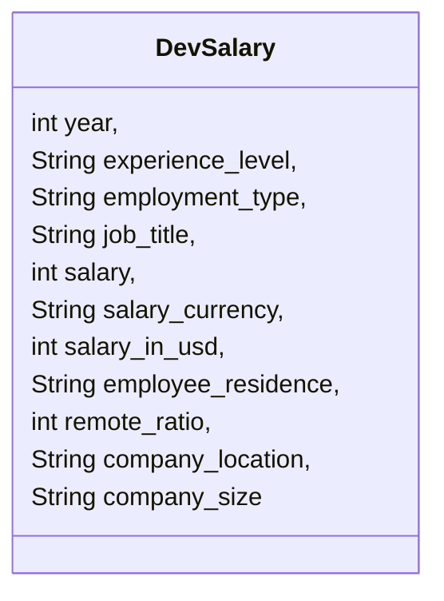
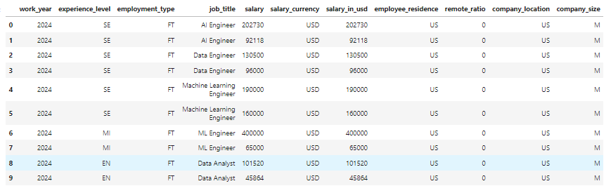

# Data Developer Salary 2024 Analysis💰
Este projeto conclusão de módulo do curso Backend Java, oferecido pela 
ADA em parceria com o Santander, focado em programação funcional e leitura de 
arquivos CSV em Java.
<p align="center">
     <a alt="Java" href="https://java.com" target="_blank">
        
    </a>
     <a alt="Maven" href="https://maven.apache.org/index.html" target="_blank">
        
    </a>
     <a alt="IntelliJ IDEA" href="https://www.jetbrains.com/idea/" target="_blank">
        
    </a>
</p>

## Visão Geral do Projeto

O objetivo principal é analisar dados salariais e padrões de emprego de desenvolvedores de dados com base na base de dados  ["Data Developer Salary 
2024"](https://www.kaggle.com/datasets/zeesolver/data-eng-salary-2024/data). As análises incluem tendências salariais, comparação entre tipos de emprego, níveis de experiência e localizações geográficas, utilizando técnicas de programação funcional.

---

## Sumário

- [Funcionalidades](#funcionalidades)
- [Diagrama de Classes](#diagrama-de-classes)
- [Estrutura dos Dados](#estrutura-dos-dados)
- [Entregáveis](#entregáveis)
- [Funcionalidades a Implementar](#funcionalidades-a-implementar)
- [Acesso ao Projeto](#acesso-ao-projeto)
- [Autores](#autores)

---
## Funcionalidades

* **Leitura de Arquivo CSV:** Extração e manipulação dos dados salariais dos 
desenvolvedores de dados.
* **Cálculos Estatísticos:**
  * Média salarial dos cargos, com foco em Data Engineers. 
  * Maior salário registrado. 
  * Diferença salarial entre trabalho remoto e presencial. 
  * Comparação de salários por nível de experiência (junior, pleno, sênior).
* **Consultas Avançadas:**
  * Identificação dos maiores salários por tipo de contrato. 
  * Localizações com os maiores salários e maior quantidade de salários reportados. 
  * Identificação do cargo mais frequente e o menos frequente no dataset. 
  * Número de empresas grandes (classificação L) presentes no dataset.

---

## Diagrama de Classes

---
## Estrutura dos Dados



---

## Entregáveis

- O projeto deve ser desenvolvido por um grupo.
- O projeto final deve ser entregue no GitHub.
- A documentação deve estar no arquivo `README.md`, incluindo diagrama de classe.

---

## Funcionalidades a Implementar

- **Paginação para as listas de dados envolvidas**.
- **Persistência dos dados:** em arquivos, memória ou base de
  dados.

---
## Acesso ao projeto

Para acessar e rodar o projeto, siga as etapas abaixo:

1.  Clone este repositório para o seu ambiente local usando o seguinte comando no terminal:
```bash    
    `git clone git@github.com:biancasanches-dev/datadev-salaries-2024` 
```
O dataset utilizado neste projeto foi obtido do Kaggle e pode ser encontrado 
neste [link](https://www.kaggle.com/datasets/zeesolver/data-eng-salary-2024/data).

2.  Abra o projeto na sua IDE de preferência.
3.  Importe o projeto selecionando a pasta onde você clonou o repositório.
4.  Localize o arquivo chamado Main.java.
     * Certifique-se de que o projeto está configurado com a versão correta do JDK.
5. Com o arquivo aberto, clique com o botão direito e selecione Run Main.main() ou vá até o menu de execução e selecione "Run".

> Alternativamente, digite o comando de execução no terminal da IDE:
```bash
java -cp out/production/seu-projeto Main
```
>* Ajuste o caminho, se necessário, para o diretório compilado da sua IDE.
<br>
A execução exibe o menu de apresentação no terminal embutido da IDE. 
<br>

---

## Autores
<table>
  <tr>
    <td align="center">
      <a href="https://github.com/AlissonRafSilva">
        <br />
        <sub><b>Alisson Silva</b></sub>
      </a>
    </td>
    <td align="center">
      <a href="https://github.com/biancasanches-dev">
        <br />
        <sub><b>Bianca Sanches</b></sub>
      </a>
    </td>
    <td align="center">
      <a href="https://github.com/czagiacomo">
        <br />
        <sub><b>Catharina Zagiacomo</b></sub>
      </a>
    </td>
    <td align="center">
      <a href="https://github.com/Elisabete-MO">
        <br />
        <sub><b>Elisabete Oliveira</b></sub>
      </a>
    </td>
    <td align="center">
      <a href="https://github.com/iagooteles">
        <br />
        <sub><b>Iago Teles</b></sub>
      </a>
    </td>
    <td align="center">
      <a href="https://github.com/Luanamero">
        <br />
        <sub><b>Luana de Méro Omena</b></sub>
      </a>
    </td>
    <td align="center">
      <a href="https://github.com/Nathalia-Asantos">
        <br />
        <sub><b>Nathalia Santos</b></sub>
      </a>
    </td>
  </tr>
</table>
